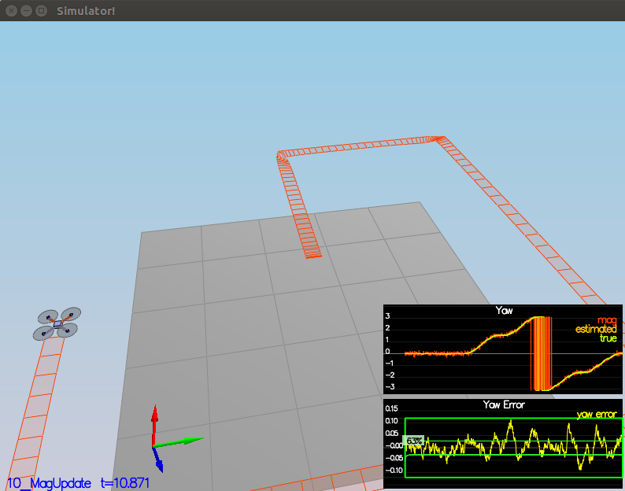

### My Report

Determine the standard deviation of the measurement noise of both GPS X data and Accelerometer X data.
I implemented this with the code below
```python
import numpy as np
paths = ["/home/chu-chu/flying_car_nanodegree/FCND-Estimation-CPP/config/log/Graph1.txt", "/home/chu-chu/flying_car_nanodegree/FCND-Estimation-CPP/config/log/Graph2.txt"]
for path in paths:
    data = np.loadtxt(path, skiprows=1, dtype=np.float64, delimiter=',')
    std = np.std(data[:,1])
    print(std)
```
My values were
* MeasuredStdDev_GPSPosXY = 0.7063681747857126
* MeasuredStdDev_AccelXY = 0.5080164803923186
###### Results


##### Implement a better rate gyro attitude integration scheme in the UpdateFromIMU() function.

```cpp
Mat3x3F rotation_matrix = Mat3x3F();
rotation_matrix(0,0) = 1.0;
rotation_matrix(0,1) = sin(rollEst) * tan(pitchEst);
rotation_matrix(0,2) = cos(rollEst) * tan(pitchEst);
rotation_matrix(1,1) = cos(rollEst);
rotation_matrix(1,2) = -sin(rollEst);
rotation_matrix(2,1) = sin(rollEst) / cos(pitchEst);
rotation_matrix(2,2) = cos(rollEst) / cos(pitchEst);

V3F turn_rates_body_frame = rotation_matrix * gyro;

float predictedRoll = turn_rates_body_frame.x  * dtIMU + rollEst ;
float predictedPitch = turn_rates_body_frame.y * dtIMU + pitchEst ;
ekfState(6) = turn_rates_body_frame.z * dtIMU + ekfState(6);	// yaw

// normalize yaw to -pi .. pi
if (ekfState(6) > F_PI){
 ekfState(6) -= 2.f*F_PI;
}
if (ekfState(6) < -F_PI){ 
ekfState(6) += 2.f*F_PI;
}
 ```
 ###### Results

##### Implement all of the elements of the prediction step for the estimator.
* Dead Reckoning
    ```cpp
    V3F acceleration_inertial_frame = attitude.Rotate_BtoI(accel);
    predictedState(0) = curState(0) + curState(3)*dt;
    predictedState(1) = curState(1) + curState(4)*dt;
    predictedState(2) = curState(2) + curState(5)*dt;
    predictedState(3) = curState(3) + acceleration_inertial_frame.x * dt; 
    predictedState(4) = curState(4) + acceleration_inertial_frame.y * dt;  
    predictedState(5) = curState(5) + acceleration_inertial_frame.z * dt - CONST_GRAVITY * dt;
    ```
* Partial derivative of the body-to-global rotation matrix
    ```cpp
    RbgPrime(0, 0) = -cos(pitch) * sin(yaw);
    RbgPrime(0, 1) = -sin(roll) * sin(pitch) * sin(yaw) - cos(roll) * cos(yaw);
    RbgPrime(0, 2) = -cos(roll) * sin(pitch) * sin(yaw) + sin(roll) * sin(yaw);
    RbgPrime(1, 0) = cos(pitch) * cos(yaw);
    RbgPrime(1, 1) = sin(roll) * sin(pitch) * sin(yaw) - cos(roll) * sin(yaw);
    RbgPrime(1, 2) = cos(roll) * sin(pitch) * cos(yaw) + sin(roll) * sin(yaw);
    ```
* The Jacobian
    ```cpp
    gPrime(0,3) = dt;
    gPrime(1,4) = dt;
    gPrime(2,5) = dt;
    
    gPrime(3, 6) = (RbgPrime(0) * accel).sum() * dt;
    gPrime(4, 6) = (RbgPrime(1) * accel).sum() * dt;
    gPrime(5, 6) = (RbgPrime(2) * accel).sum() * dt;
    
    ekfCov = gPrime * ekfCov * gPrime.transpose() + Q;
    ```
    
 ###### Results


##### Implement the magnetometer update.
```cpp
hPrime(6) = 1;

zFromX(0) = ekfState(6);
float diff = magYaw - ekfState(6);
if (diff > F_PI) {
  zFromX(0) += 2.f*F_PI;
} 
else if (diff < -F_PI) {
  zFromX(0) -= 2.f*F_PI;
}
 ```
 ###### Results
 
##### Implement the GPS update.
```cpp
for ( int i = 0; i < 6; i++) {
    zFromX(i) = ekfState(i);
    hPrime(i,i) = 1.0;
    }
```
 ###### Results
 
 
 
